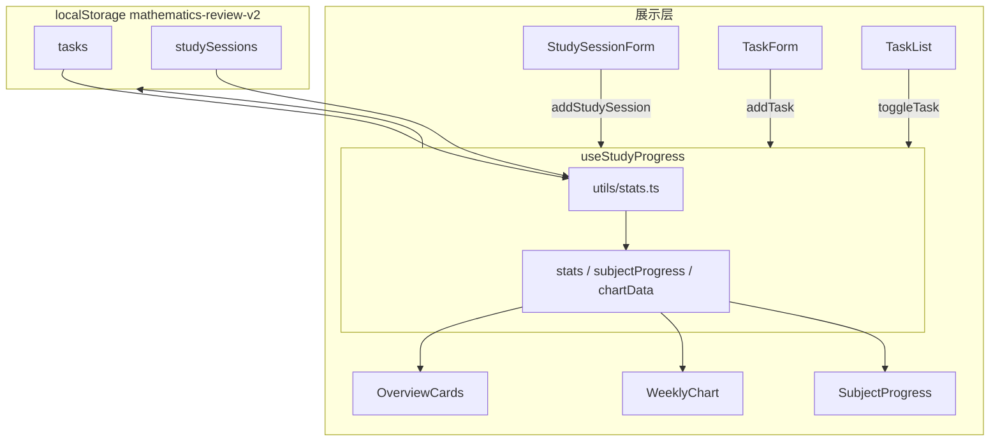

# 考研数学复习进度看板

一个面向考研生的**单页学习记录工具**，用于管理复习任务、记录学习时长并可视化进度。  
本项目**没有后端**，数据通过 `localStorage` 持久化在浏览器本地，刷新页面后仍可保留。

---

## 功能一览

| 模块 | 说明 |
|------|------|
| **顶部概览** | 今日学习时长、本周学习时长、已完成任务数、连续学习天数 |
| **科目进度** | 数学分析、高等代数、英语 — 优先按预计耗时计算进度 |
| **学习图表** | 最近 7 天学习时长柱状图（来自真实学习记录） |
| **记录学习时长** | 选择科目、输入分钟数、可选备注，提交后更新统计与图表 |
| **添加任务** | 创建带难度、预计耗时、优先级、截止日期的复习任务 |
| **任务列表** | 点击切换完成状态；支持按状态/科目筛选 |
| **本地持久化** | 任务与学习记录自动保存，支持一键重置为初始数据 |
| **响应式布局** | 手机单列、桌面多列，适配不同屏幕 |

---

## v2 改进点

- **任务完成与学习时长解耦**：勾选任务不再自动增加今日学习分钟数
- **新增 `StudySession` 数据模型**：学习时长统计全部来自手动记录
- **`localStorage` 持久化**（key: `mathematics-review-v2`），刷新不丢数据
- **科目进度按 `estimatedMinutes` 加权**，更贴近真实复习量
- **任务筛选、优先级标识、逾期提示、完成时间显示**
- **鼓励文案**结合今日学习时长与任务完成情况动态变化

---

## 数据模型

### Task（任务）

| 字段 | 类型 | 说明 |
|------|------|------|
| `id` | string | 唯一标识 |
| `name` | string | 任务名称 |
| `subject` | Subject | 科目 |
| `difficulty` | easy / medium / hard | 难度 |
| `estimatedMinutes` | number | 预计耗时（分钟） |
| `completed` | boolean | 是否完成 |
| `priority` | low / medium / high | 优先级 |
| `dueDate` | string? | 截止日期 YYYY-MM-DD |
| `createdAt` | string | 创建时间 ISO |
| `completedAt` | string \| null | 完成时间，未完成时为 null |

### StudySession（学习记录）

| 字段 | 类型 | 说明 |
|------|------|------|
| `id` | string | 唯一标识 |
| `subject` | Subject | 科目 |
| `minutes` | number | 学习时长（分钟） |
| `date` | string | 日期 YYYY-MM-DD |
| `note` | string? | 可选备注 |

### Subject（科目）

- `math-analysis` — 数学分析
- `linear-algebra` — 高等代数
- `english` — 英语

---

## 统计规则

| 指标 | 计算方式 |
|------|----------|
| 今日学习 | 今天所有 `StudySession.minutes` 之和 |
| 本周学习 | 最近 7 天 `StudySession.minutes` 之和 |
| 连续学习天数 | 从今天（或昨天，若今天尚无记录）往前数连续有学习记录的天数 |
| 已完成任务 | `Task.completed === true` 的数量 |
| 科目进度 | 优先：已完成任务预计耗时 / 该科全部任务预计耗时；无预计耗时时退化为任务数量比 |
| 7 天柱状图 | 按 `StudySession` 聚合，星期标签根据真实日期动态生成 |

---

## 本地存储说明

- **Storage Key**：`mathematics-review-v2`
- **存储内容**：`{ tasks, studySessions }`
- **首次访问**：使用 `mockData.ts` 中的初始数据
- **解析失败**：自动 fallback 到初始数据，避免页面崩溃
- **重置数据**：页脚「清空本地数据并恢复初始数据」按钮，需 `window.confirm` 二次确认

---

## 技术栈

| 技术 | 作用 |
|------|------|
| [React 19](https://react.dev/) | 构建用户界面 |
| [TypeScript](https://www.typescriptlang.org/) | 类型安全 |
| [Vite](https://vite.dev/) | 开发服务器与生产构建 |
| [Tailwind CSS v4](https://tailwindcss.com/) | 实用类样式 |
| [Recharts](https://recharts.org/) | 近 7 天学习时长柱状图 |

---

## 快速开始

### 环境要求

- [Node.js](https://nodejs.org/) 18 或更高版本（建议 LTS）
- npm（随 Node 安装）

### 安装与运行

```bash
cd cursor_web_test
npm install
npm run dev
```

终端会输出本地地址（通常是 `http://localhost:5173`），用浏览器打开即可。

### 其他命令

```bash
npm run build    # 类型检查 + 生产构建
npm run preview  # 预览构建后的静态站点
npm run lint     # ESLint 检查
```

---

## 项目架构



### 数据流

1. **初始数据**在 `src/data/mockData.ts`，首次访问或重置时使用
2. **`utils/storage.ts`** 负责 localStorage 读写与容错
3. **`useStudyProgress` Hook** 管理 `tasks` 和 `studySessions`，是唯一修改数据的地方
4. **`utils/stats.ts`** 提供纯函数计算统计、进度、筛选、鼓励文案
5. **组件**通过 props 展示数据，表单/列表通过回调触发 Hook 更新

---

## 目录结构

```
cursor_web_test/
├── index.html
├── vite.config.ts
├── package.json
├── README.md
└── src/
    ├── main.tsx
    ├── index.css
    ├── App.tsx
    ├── types.ts
    ├── data/
    │   └── mockData.ts
    ├── utils/
    │   ├── stats.ts
    │   └── storage.ts
    ├── hooks/
    │   └── useStudyProgress.ts
    └── components/
        ├── OverviewCards.tsx
        ├── SubjectProgress.tsx
        ├── WeeklyChart.tsx
        ├── TaskList.tsx
        ├── StudySessionForm.tsx
        ├── TaskForm.tsx
        ├── Filters.tsx
        └── ui/
            ├── Card.tsx
            ├── ProgressBar.tsx
            ├── Badge.tsx
            ├── Input.tsx
            ├── Select.tsx
            └── Button.tsx
```

---

## 交互说明

### 完成任务 vs 记录学习时长

- **完成任务**：仅更新任务的 `completed` 和 `completedAt`，影响任务统计与科目进度
- **记录学习时长**：新增一条 `StudySession`，影响今日/本周时长、连续天数和柱状图
- 两者相互独立，更贴近真实复习场景

### 任务筛选

- 状态：全部 / 待完成 / 已完成
- 科目：全部科目 / 数学分析 / 高等代数 / 英语

---

## 后续可扩展方向

- 导出 CSV（任务与学习记录）
- 周计划与每日目标设置
- 日历视图展示学习热力图
- 学习目标与达成率提醒
- 多设备同步（对接后端 API）

---

## 常见问题

**Q: 刷新页面后数据会丢失吗？**  
A: 不会。数据保存在 `localStorage`（key: `mathematics-review-v2`），刷新后自动恢复。

**Q: 如何恢复初始演示数据？**  
A: 点击页脚「清空本地数据并恢复初始数据」，确认即可。

**Q: 完成任务会增加学习时长吗？**  
A: 不会。v2 中任务完成与学习记录是完全独立的两套数据。

---

## 许可证

本项目为学习与演示用途，可自由修改与扩展。

**祝复习顺利，坚持每一天。**
