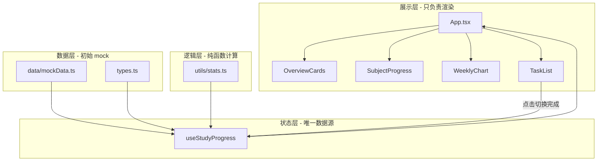

# 考研数学复习进度看板

一个面向考研生的**单页可视化网页**，用于查看复习进度、学习时长和每日任务完成情况。  
本项目**没有后端**，所有数据保存在浏览器内存中，适合作为 React + TypeScript 入门练手项目。

---

## 功能一览

| 模块 | 说明 |
|------|------|
| **顶部概览** | 今日学习时长、本周学习时长、已完成任务数、连续学习天数 |
| **科目进度** | 数学分析、高等代数、英语 — 进度条、完成百分比、剩余任务数 |
| **学习图表** | 最近 7 天学习时长柱状图（Recharts） |
| **任务列表** | 至少 6 条任务，含名称、科目、难度、完成状态 |
| **交互联动** | 点击任务左侧圆圈切换完成状态后，概览、各科进度、今日柱高**自动更新** |
| **响应式布局** | 手机单列、桌面多列，适配不同屏幕 |
| **体验细节** | 玻璃拟态卡片、hover 动效、根据完成率变化的鼓励文案 |

---

## 技术栈

| 技术 | 作用 |
|------|------|
| [React 19](https://react.dev/) | 构建用户界面 |
| [TypeScript](https://www.typescriptlang.org/) | 类型安全，减少拼写和结构错误 |
| [Vite](https://vite.dev/) | 开发服务器与生产构建，启动快 |
| [Tailwind CSS v4](https://tailwindcss.com/) | 实用类样式，快速做出现代 UI |
| [Recharts](https://recharts.org/) | 绘制近 7 天学习时长柱状图 |

---

## 快速开始

### 环境要求

- [Node.js](https://nodejs.org/) 18 或更高版本（建议 LTS）
- npm（随 Node 安装）

### 安装与运行

```bash
# 进入项目目录
cd cursor_web_test

# 安装依赖（首次克隆后执行一次）
npm install

# 启动开发服务器
npm run dev
```

终端会输出本地地址（通常是 `http://localhost:5173`），用浏览器打开即可。

### 其他命令

```bash
npm run build    # 类型检查 + 生产构建，输出到 dist/
npm run preview  # 预览构建后的静态站点
npm run lint     # 运行 ESLint 检查代码
```

---

## 项目架构（给初学者的说明）

本项目采用**分层结构**：数据、计算逻辑、状态、展示 UI 分开写，避免把所有代码堆在一个文件里。



### 数据如何流动？

1. **初始数据**写在 `src/data/mockData.ts`（任务列表、7 天学习记录）。
2. **`useStudyProgress` Hook** 用 `useState` 保存 `tasks` 和 `dailyStudy`，是唯一会改数据的地方。
3. **`utils/stats.ts`** 提供纯函数：根据当前数据算出统计数字、各科进度、鼓励文案（不直接改 state）。
4. **组件**只接收 props 并展示；用户点击任务时，调用 `toggleTask(id)`，Hook 更新 state，React 自动重新渲染整页。

这就是 React 里常见的**单向数据流**：数据从上往下传，事件从下往上回调。

---

## 目录结构

```
cursor_web_test/
├── index.html              # 页面入口 HTML
├── vite.config.ts          # Vite 配置（含 Tailwind 插件）
├── package.json
├── README.md
└── src/
    ├── main.tsx            # React 挂载入口
    ├── index.css           # 全局样式 + Tailwind 引入
    ├── App.tsx             # 页面布局与区块组合（尽量保持简洁）
    ├── types.ts            # TypeScript 类型定义
    ├── data/
    │   └── mockData.ts     # 初始任务、7 天学习数据
    ├── utils/
    │   └── stats.ts        # 统计计算、文案、难度→分钟映射
    ├── hooks/
    │   └── useStudyProgress.ts   # 状态 + toggleTask 联动逻辑
    └── components/
        ├── OverviewCards.tsx     # 顶部 4 张概览卡
        ├── SubjectProgress.tsx     # 三科进度
        ├── WeeklyChart.tsx       # 柱状图
        ├── TaskList.tsx          # 任务列表
        └── ui/
            ├── Card.tsx          # 通用玻璃卡片
            ├── ProgressBar.tsx   # 进度条
            └── Badge.tsx         # 科目标签
```

**阅读顺序建议**（由浅入深）：

1. `types.ts` — 了解有哪些数据结构  
2. `data/mockData.ts` — 看初始数据长什么样  
3. `utils/stats.ts` — 看数字怎么算出来  
4. `hooks/useStudyProgress.ts` — 看点击任务后发生了什么  
5. `App.tsx` + `components/*` — 看界面怎么拼起来  

---

## 设计思路

### 1. 为什么不用后端？

考研进度看板在本阶段只需要**演示与练习**。把数据放在前端可以：

- 零部署成本，双击 `npm run dev` 就能跑  
- 专注学习 React 状态与组件，不被接口、数据库分散注意力  

以后若要持久化，可把 `useStudyProgress` 里的 state 换成 `localStorage` 或对接 API，组件层几乎不用大改。

### 2. 为什么用 Custom Hook？

`toggleTask` 同时要改「任务完成状态」和「今日学习分钟数」。若写在 `TaskList` 里，其他组件很难共享同一份数据。

把状态和更新逻辑收进 `useStudyProgress`，`App` 只负责：

```tsx
const { tasks, dailyStudy, stats, subjectProgress, toggleTask } = useStudyProgress()
```

各子组件通过 props 拿数据，职责清晰，也方便单独阅读 Hook 理解业务规则。

### 3. 为什么统计放在 `utils/stats.ts`？

`computeStats`、`computeSubjectProgress` 等是**纯函数**：给定输入一定得到相同输出，不依赖 React。

好处：

- 容易单独理解公式（如连续天数怎么数）  
- 将来写单元测试时可直接 `import` 测试，无需渲染组件  

### 4. 任务完成如何联动「今日时长」？

难度与预估学习时长（分钟）的映射：

| 难度 | 分钟 |
|------|------|
| 简单 | 30 |
| 中等 | 45 |
| 困难 | 60 |

勾选任务 → 今日 `dailyStudy` 最后一项 `minutes` **增加**对应分钟；取消勾选则**扣回**（不低于 0）。  
本周时长 = 7 天 `minutes` 之和，与柱状图同源，保证图表与概览一致。

### 5. UI 与响应式

- **Tailwind 实用类**：如 `grid-cols-1 lg:grid-cols-2`，小屏单列、大屏双列。  
- **深色渐变 + 半透明卡片**：减少视觉疲劳，突出数据。  
- **科目配色**：数学分析（蓝）、高等代数（紫）、英语（绿），便于一眼区分。  
- **鼓励文案**：根据 `已完成数 / 总任务数` 在 `getEncouragement` 中返回不同句子，增强反馈感。

---

## 如何修改数据（练手入口）

### 增删任务

编辑 `src/data/mockData.ts` 中的 `initialTasks` 数组，每条任务需包含：

```ts
{
  id: '唯一字符串',
  name: '任务名称',
  subject: 'math-analysis' | 'linear-algebra' | 'english',
  difficulty: 'easy' | 'medium' | 'hard',
  completed: false,  // 是否已完成
}
```

### 修改 7 天学习记录

同一文件中的 `initialDailyStudy` 由 `buildDailyStudy()` 生成，可改 `minutes` 数组调整各天柱高（最后一项为「今天」）。

### 改难度对应时长

编辑 `src/utils/stats.ts` 里的 `DIFFICULTY_MINUTES` 对象即可。

---

## 页面结构示意

```
┌─────────────────────────────────────────────┐
│  标题 + 鼓励文案                              │
├──────────┬──────────┬──────────┬──────────────┤
│ 今日学习 │ 本周学习 │ 已完成   │ 连续学习天数 │
├──────────┴──────────┴──────────┴──────────────┤
│  数学分析 │ 高等代数 │ 英语  （进度条）        │
├────────────────────┬────────────────────────┤
│  近 7 天柱状图      │  任务列表（可勾选）      │
└────────────────────┴────────────────────────┘
```

---

## 常见问题

**Q: 刷新页面后数据会丢失吗？**  
A: 会。当前数据只在内存中，刷新会恢复为 `mockData.ts` 的初始值。若要保存，可自行用 `localStorage` 在 Hook 里读写。

**Q: 构建时提示 chunk 较大？**  
A: Recharts 体积较大，属正常现象。学习阶段可忽略；上线时可考虑按需加载图表库。

**Q: 我不会 React，从哪里学？**  
A: 建议先看 [React 官方教程](https://react.dev/learn)，重点理解：组件、props、state、`useState`、`useMemo`。再结合本仓库从 `App.tsx` 和 `useStudyProgress.ts` 对照阅读。

---

## 许可证

本项目为学习与演示用途，可自由修改与扩展。

---

**祝复习顺利，坚持每一天。**
